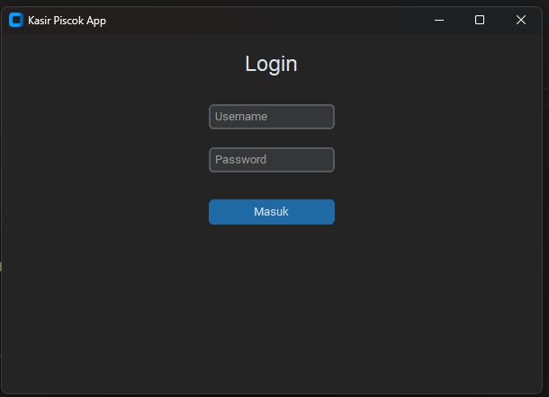
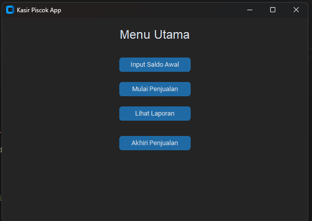

[DESKTOP GUI APP - KASIR SEDERHANA]

# Cara Menjalankan

1. Download source codenya
2. Copy ke folder projek mu
3. Buka terminal (cmd/shell/vscode)
4. Jalankan perintah berikut di terminal:

```bash
cd "folder projekmu"
pip install customtkinter
py test.py
```

## Preview







